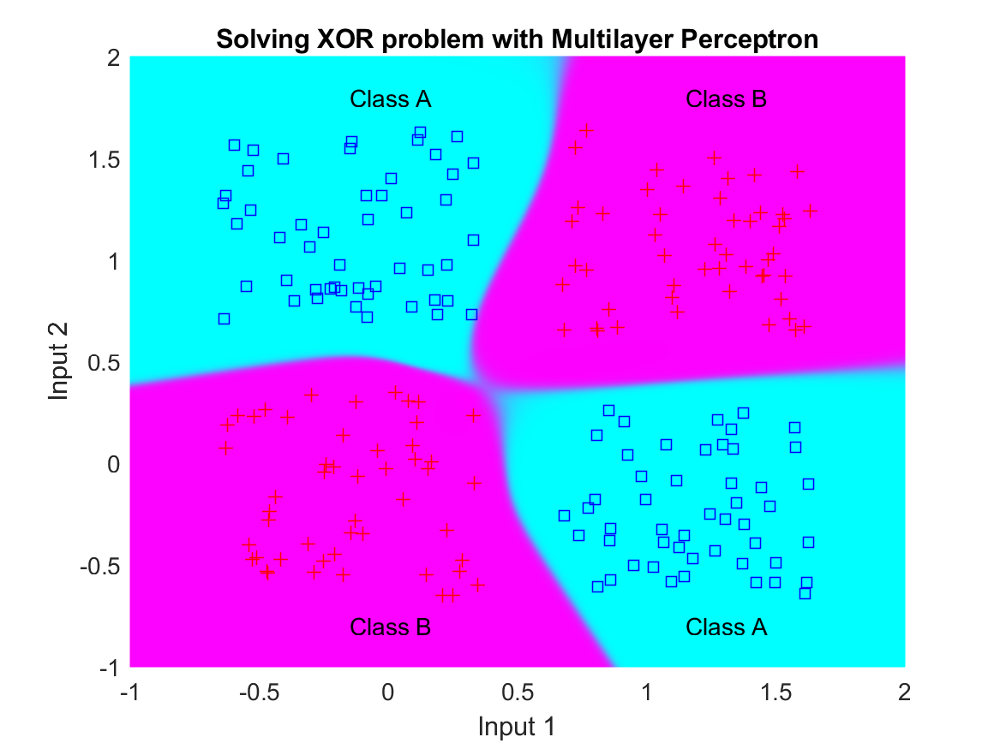
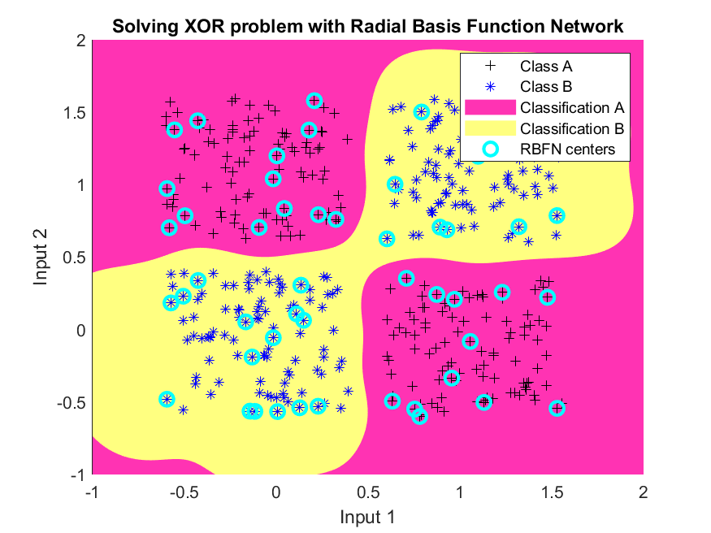
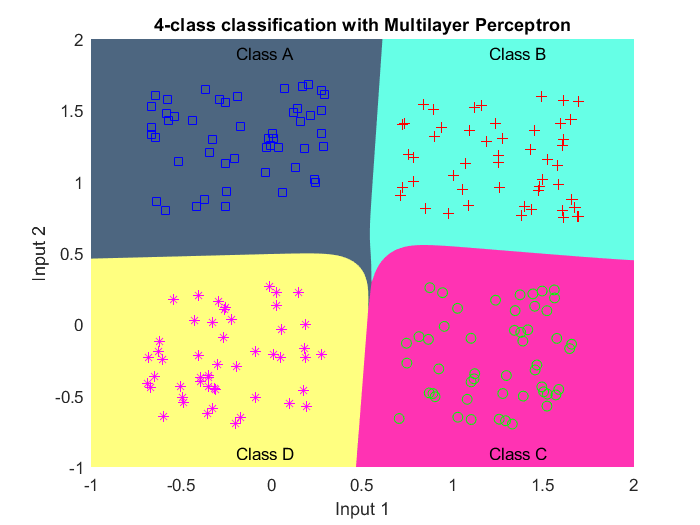
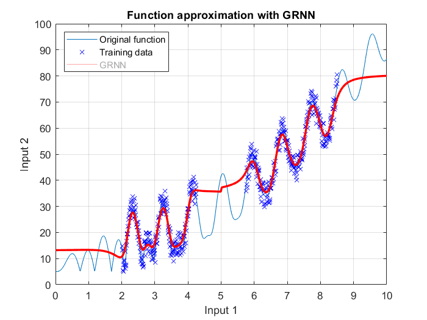
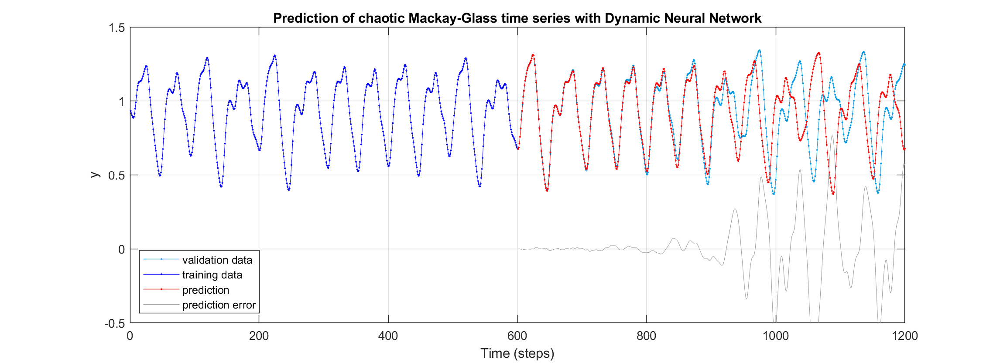
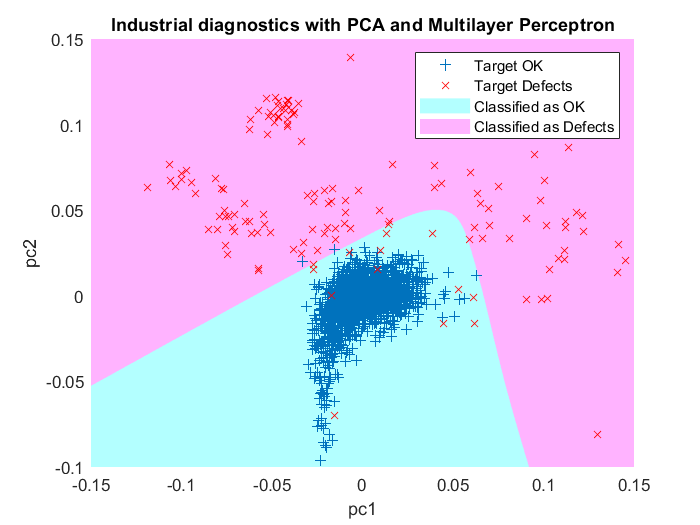
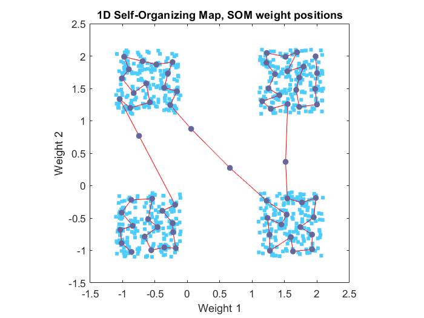
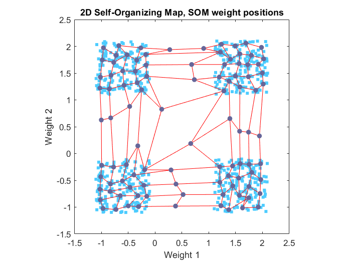

# Fundamentals of Neural Networks

## Curriculum Module

_Created with MATLAB R2022a. Compatible with MATLAB R2022a and later releases._

2022 © Primož Potočnik ([University of Ljubljana](https://www.uni-lj.si/), [Faculty of Mechanical Engineering](https://www.fs.uni-lj.si/))

## Description

This teaching package contains modular contents for the introduction of the fundamentals of Neural Networks. The package consists of a series of MATLAB [Live Scripts](https://www.mathworks.com/products/matlab/live-editor.html) with complementary PowerPoint presentations. 
[MATLAB](https://www.mathworks.com/matlab) is a programming and numeric computing platform developed by [MathWorks](https://www.mathworks.com/company).

The package is intended to gradually guide the students toward basic concepts in neural networks through general demonstrations applicable to every field, spanning from science to engineering. The materials also include a classical engineering problem, namely industrial diagnostics of compressor connection rod defects.

The contents are mainly addressed towards undergraduate courses, however, the modular structure allows further integration within other (postgraduate) AI-based courses. Course application areas include Neural Networks, Deep Learning, Machine Learning, Industrial diagnostics and Condition Monitoring, and Autonomous Systems.

## Examples

|  Solving XOR problem with Multilayer Perceptron |  Solving XOR problem with Radial Basis Function Network |  4-class classification with Multilayer Perceptron |
| ----------- | ----------- | ----------- |

|  Function approximation with GRNN |  Prediction of chaotic Mackay-Glass time series with Dynamic Neural Network  | 
| ----------- | ----------- |

|  Industrial diagnostics with PCA and Multilayer Perceptron |  1D Self-Organizing Map in 2D input space |  2D Self-Organizing Map in 2D input space | 
| ----------- | ----------- | ----------- |

## Instructions

The teaching materials can be approached either by following the Live Scripts or the PowerPoint presentations. Open the introductory live script [NN0b\_Contents\_and\_instructions.mlx](NN0%20-%20Contents/NN0b_Contents_and_instructions.mlx) or the introductory presentation [NN0a\_Contents\_and\_instructions.pptx](NN0%20-%20Contents//NN0a_Contents_and_instructions.pptx) and follow the presentation.

### Live Scripts

The instructions inside the Live Scripts will guide you through the activities and exercises. We suggest running each section within a Live Script individually. 
Interactive Live Script controls(sliders, checkboxes, buttons, etc.) invite you to experiment with various parameter configurations. See also the introductory video on [How to use Live Script Controls](https://www.mathworks.com/support/search.html/videos/how-to-use-live-editor-controls-1569868241587.html).
Each Live Script also contains a link to the complementary PowerPoint presentation.

### PowerPoint presentations

The teaching can also be approached by following the PowerPoint presentations. In this case, each presentation will provide links to the complementary Live Script examples.

## Contents

Live Scripts with complementary PowerPoint presentations are available in folders containing the following chapters: 

0. [NN0 - Contents and instructions](./NN0%20-%20Contents/)
1. [NN1 - Introduction to neural networks](./NN1%20-%20Introduction/)
2. [NN2 - Neuron model, network architectures, learning](./NN2%20-%20Neuron%20and%20architectures/)
3. [NN3 - Perceptron and ADALINE](./NN3%20-%20Perceptron%20and%20Adaline/)
4. [NN4 - Backpropagation](./NN4%20-%20Backpropagation/)
5. [NN5 - Dynamic networks](./NN5%20-%20Dynamic%20networks/)
6. [NN6 - Radial basis function networks](./NN6%20-%20RBFN/)
7. [NN7 - Self-organizing maps](./NN7%20-%20SOM/)
8. [NN8 - Practical considerations](./NN8%20-%20Practical/)

## Learning goals

- Introduce the principles and methods of neural networks (NN)
- Present the principal NN models
- Demonstrate the process of applying NN
- Understand the concept of nonparametric modeling by NN
- Explain the most common NN architectures
  - Feedforward networks
  - Dynamic networks
  - Radial Basis Function Networks
  - Self-organized networks
- Develop the ability to construct NN for solving real-world problems
  - Design proper NN architecture
  - Achieve good training and generalization performance
  - Implement a neural network solution

## Suggested Prework

No prior exposure to the subject of neural networks and/or machine learning is assumed.

### Introduction to MATLAB

[MATLAB Onramp](https://www.mathworks.com/learn/tutorials/matlab-onramp.html) - Learn the essentials of MATLAB through this free, two-hour introductory tutorial on commonly used features and workflows.

## Additional Resources

### Introduction to Machine Learning

[Machine Learning Onramp](https://www.mathworks.com/learn/tutorials/machine-learning-onramp.html) - This free, two-hour tutorial provides an interactive introduction to practical machine learning methods for classification problems.

### Introduction to Deep learning

[Deep Learning Onramp](https://www.mathworks.com/learn/tutorials/deep-learning-onramp.html) - This free, two-hour deep learning tutorial provides an interactive introduction to practical deep learning methods. You will learn to use deep learning techniques in MATLAB for image recognition.

### Educator Resources

- [Featured Courseware](https://www.mathworks.com/academia/courseware/course-materials.html)
- [Teach with MATLAB and Simulink](https://www.mathworks.com/academia/educators.html)
- [MATLAB Grader](https://www.mathworks.com/products/matlab-grader.html)

Have any questions or feedback? Contact the [MathWorks online teaching team.](mailto:onlineteaching@mathworks.com)

### Recommended Books

Simon Haykin, Neural Networks and Learning Machines. Pearson, 3rd edition, 2009.

## Products

MATLAB, Statistics and Machine Learning Toolbox™, Deep Learning Toolbox™

## License

The license for this module is available in the [LICENSE.TXT](LICENSE) file in this repository.

## Acknowledgments

The development of this Curriculum Module was supported by [MathWorks](https://www.mathworks.com/).
Special thanks to dr. Marco Rossi, dr. Julia Hoerner, and dr. Jianghao Wang.
